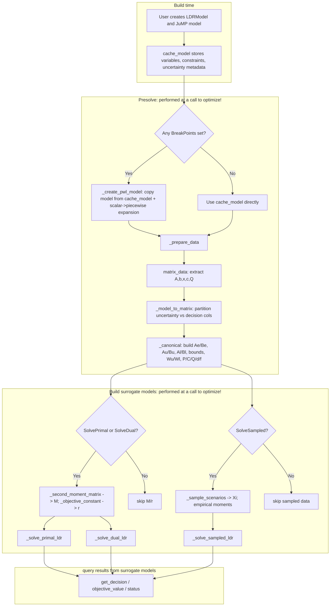

# Developer information flow: JuMP model -> LDR surrogates

This page documents the internal execution flow in `LinearDecisionRules.jl` from:

1. user model construction (`@variable`, `@constraint`, `@objective`),
2. uncertainty and first-stage metadata capture,
3. canonicalization and moment/scenario preprocessing,
4. construction of primal/dual/sampled surrogate models,
5. and decision-rule coefficient extraction.

It is meant as a developer map for extension and generalization work.

## High-level flow

## Stage-by-stage details and dependencies

### 1) Model object and metadata capture

Primary code:
- `src/jump.jl`: `StochasticModel`, `LDRModel`, `Uncertainty`, `FirstStage`, `BreakPoints`, JuMP wrappers.

`LDRModel` keeps three layers of state:
- User/cache layer:
  - `cache_model::StochasticModel` is the authoritative JuMP model authored by users.
  - `cache_model.first_stage`: set of non-anticipative vars.
  - `cache_model.uncertainty_to_distribution`: map `variable -> (distribution_idx, inner_idx)`.
  - `cache_model.scalar_distributions`, `cache_model.vector_distributions`.
  - `cache_model.uncertainty_valid_constraints`: additional constraints returned by `_valid_constraints(dist)`.
- Optional PWL-transformed layer:
  - `pwl_model::StochasticModel` + `map_cache_to_pwl` + `extended_variables`.
- Surrogate solve layer:
  - `primal_model`, `dual_model`, `sampled_model` (all JuMP models).

Important capture points:
- Scalar uncertainty:
  - `JuMP.add_variable(model::LDRModel, uncertainty::_ScalarUncertainty, ...)`
  - pushes distribution to `scalar_distributions`, records `(dist_idx, 0)`.
- Vector uncertainty:
  - `JuMP.add_variable(model::LDRModel, uncertainty::_VectorUncertainty, ...)`
  - pushes distribution to `vector_distributions`, records `(dist_idx, inner_idx)` for each component.
  - optional `_valid_constraints(dist)` rows are injected as model constraints and tracked.
- First-stage variable:
  - `JuMP.add_variable(model::LDRModel, first_stage::FirstStage, ...)`
  - records variable in `cache_model.first_stage`.
- Piecewise option:
  - `set_attribute(var, BreakPoints(), ...)` stores breakpoints in `model.pwl_data` (scalar uncertainty only).

### 2) Entry point orchestration: `optimize!(model::LDRModel)`

Primary code:
- `src/jump.jl`: `JuMP.optimize!(model::LDRModel)`.

Execution order:
1. Validate solver and mode flags.
2. If `pwl_data` is non-empty, call `_create_pwl_model(model)`.
3. Call `_prepare_data(model)`.
4. Conditionally build/solve:
   - `_solve_primal_ldr(model)` if `solve_primal`.
   - `_solve_dual_ldr(model)` if `solve_dual`.
   - `_solve_sampled_ldr(model)` if `solve_sampled`.

### 3) Optional PWL expansion (`_create_pwl_model`)

Primary code:
- `src/pwl.jl`: `_create_pwl_model`, `_add_pwl_vars_to_constraints`, `_add_pwl_constraints`.
- `src/distributions/univariate_piece_wise.jl`: `UnivariatePieceWise`.

What it does:
- Copies `cache_model.model` to `pwl_model.model` with `JuMP.copy_model`.
- Rebuilds metadata sets/maps on the copied variables.
- For each scalar uncertainty with breakpoints:
  - converts original scalar distribution -> vector distribution `UnivariatePieceWise(original, break_points)`.
  - reuses original uncertainty variable as piece 1 and creates additional piece variables.
  - propagates old uncertainty coefficient into all new piece vars in existing constraints.
  - adds linking/validity constraints over pieces.
  - records piece vars in `extended_variables[uncertainty_pwl]`.

Why this matters for dependencies:
- After this stage, downstream canonicalization sees a model with expanded uncertainty dimension.
- Any API that maps user vars to coefficients (`get_decision`) must translate cache vars -> pwl vars.

### 4) Data extraction + canonicalization (`_prepare_data`)

Primary code:
- `src/canonical.jl`: `_prepare_data`, `_model_to_matrix`, `_canonical`, `_second_moment_matrix`, `_sample_scenarios`.
- `src/matrix_data.jl`: `matrix_data`.

Selected base model:
- If no PWL: `stoch_model = cache_model`.
- If PWL active: `stoch_model = pwl_model`.

#### 4.1 Matrix extraction (`matrix_data`)

Builds LP/QP matrix representation:
- constraints: `A`, `b_lower`, `b_upper`
- variable bounds: `x_lower`, `x_upper`
- objective: `c`, `Q`, `c_offset`, `sense`
- variable ordering: `variables`
- index lists: `integers`, `binaries`

#### 4.2 Partition and indexing (`_model_to_matrix`)

From `MatrixData` + uncertainty/first-stage maps, computes:
- `uncertainty_indices`: columns corresponding to uncertain variables.
- `variable_indices`: columns corresponding to decision variables.
- `column_to_canonical`: map from original column index -> canonical local index.
- `first_stage_indices`: first-stage variable indices.
- `uncertainty_valid_indices`: rows belonging to extra valid constraints.

Stored in `model.ext`:
- `:_LDR_var_to_column`
- `:_LDR_column_to_canonical`

#### 4.3 Canonical objects (`_canonical`)

Builds canonical blocks:
- Decision-side constraints:
  - `Ae, Be` for equalities
  - `Au, Bu` for upper inequalities
  - `Al, Bl` for lower inequalities
  - `xu, xl` variable bounds
- Uncertainty-set representation:
  - `Wu, hu`, `Wl, hl`
  - `Wu_v, hu_v`, `Wl_v, hl_v` (from `_valid_constraints`)
  - `lb, ub`
- Objective decomposition:
  - `P` (quadratic in decisions)
  - `C` (linear/cross term block)
  - `Q`, `d`, `f` (uncertainty-only parts)
- Integrality tags:
  - `bin`, `int`

Returned tuple is stored as:
- `model.ext[:_LDR_ABC] = ABC`
- `model.ext[:_LDR_sense] = data.sense`
- `model.ext[:_LDR_first_stage_indices] = first_stage_indices`

#### 4.4 Moment computation for primal/dual (`_second_moment_matrix`)

If `solve_primal || solve_dual`:
- Computes augmented second-moment matrix $M = E[\tilde{\xi}\tilde{\xi}^\top]$, where $\tilde{\xi} = [1;\eta]$.
- Uses analytical means/covariances when possible.
- Uses grouped rejection sampling when uncertainty constraints couple distributions.
- Computes constant objective part:
  - `r = _objective_constant(ABC, M)`.

Stored in `model.ext`:
- `:_LDR_M`
- `:_LDR_r`

#### 4.5 Scenario generation for sampled mode (`_sample_scenarios`)

If `solve_sampled`:
- Samples `Xi` matrix (`dim_augmented_uncertainty x N`) with first row equal to 1.
- Reuses grouped rejection logic for constrained uncertainty.
- Stores:
  - `:_LDR_scenarios = Xi`
  - `:_LDR_r_sampled`
  - and either
    - `:_LDR_M_empirical` (if quadratic/cross terms require empirical second moments), or
    - `:_LDR_μ_empirical` (if linear objective in decision rules is enough).

### 5) Surrogate model construction

#### 5.1 Primal surrogate

Primary code:
- `src/solve_primal.jl`: `_solve_primal_ldr`.

Consumes:
- `ABC`, `M`, `r`, `first_stage_indices`, `sense`, solver/silent flags.

Builds:
- Decision-rule coefficient matrix `X`:
  - first-stage rows only have column 1 free (constant term), other columns fixed to zero implicitly.
- Slack matrices `Su`, `Sl`, `Sxu`, `Sxl`.
- Dual-multiplier matrices `Lambda* >= 0` proving nonnegativity over uncertainty polyhedron.
- Objective:
  - $\operatorname{tr}(X^\top P X M) + \operatorname{tr}(C^\top X M) + r$.

#### 5.2 Dual surrogate

Primary code:
- `src/solve_dual.jl`: `_solve_dual_ldr`.

Consumes same inputs as primal.

Key difference:
- Replaces explicit `Lambda` multipliers with moment-based inequality form:
  - build `W2 = W - h e_1^\top`, then enforce `S * ((W2 * M)^\top) >= 0`.

Objective form is the same trace expression as primal.

#### 5.3 Sampled (SAA) surrogate

Primary code:
- `src/solve_sampled.jl`: `_solve_sampled_ldr`.

Consumes:
- `ABC`, `Xi`, sampled objective constants/moments, `first_stage_indices`, `sense`.

Builds:
- Same `X` structure (first-stage restrictions preserved).
- Scenario-wise constraints for each sampled uncertainty vector.
- Objective uses empirical moments (`M_hat`) or empirical mean (`mu_hat`) depending on structure.

### 6) Decision-rule extraction APIs

Primary code:
- `src/implement_rule.jl`: `get_decision(model, x)`, `get_decision(model, x, eta; piece=...)`.

How indices are resolved:
1. Validate that `x` is a decision var and `eta` is an uncertainty var (for 3-arg form).
2. If PWL was activated, map cache variables through `map_cache_to_pwl`; if `eta` has breakpoints, require `piece` and select piece variable from `extended_variables`.
3. Use `:_LDR_var_to_column` and `:_LDR_column_to_canonical` to find row/column in `X`.
4. Read from selected surrogate model (`primal_model`, `dual_model`, or `sampled_model`).

Interpretation:
- `get_decision(model, x)` -> constant term of rule for `x`.
- `get_decision(model, x, eta)` -> coefficient multiplying uncertainty `eta`.

## Dependency map by artifact

### Core artifacts and producers

- `cache_model`:
  - produced incrementally by JuMP wrappers in `src/jump.jl`.
- `pwl_model`, `map_cache_to_pwl`, `extended_variables`:
  - produced by `_create_pwl_model` in `src/pwl.jl`.
- `MatrixData`:
  - produced by `matrix_data` in `src/matrix_data.jl`.
- `ABC`:
  - produced by `_canonical` in `src/canonical.jl`.
- `M`, `r`:
  - produced by `_second_moment_matrix` and `_objective_constant` in `src/canonical.jl`.
- `Xi`, `M_hat`/`mu_hat`, `r_sampled`:
  - produced by `_sample_scenarios` and sampled branch of `_prepare_data`.
- Surrogate JuMP models and variable `X`:
  - produced by `_solve_primal_ldr`, `_solve_dual_ldr`, `_solve_sampled_ldr`.

### `model.ext` contract used across stages

Keys written in preprocessing and consumed later:
- `:_LDR_var_to_column`
- `:_LDR_column_to_canonical`
- `:_LDR_ABC`
- `:_LDR_sense`
- `:_LDR_first_stage_indices`
- `:_LDR_M`
- `:_LDR_r`
- `:_LDR_scenarios`
- `:_LDR_M_empirical`
- `:_LDR_μ_empirical`
- `:_LDR_r_sampled`

When extending the package, preserving this contract (or migrating all consumers) is the key to avoiding hidden regressions.

## Extension points for generalization

Useful places to hook new behavior:

1. New uncertainty geometry:
- Implement `_valid_constraints(dist)` for tighter polyhedral outer approximations.
- Ensure `minimum(dist)`, `maximum(dist)`, `mean/cov` or reliable sampling behavior exist.

2. Alternative canonical forms:
- Extend `_canonical` to support richer constraint/objective classes.
- If changing canonical blocks, update all surrogate builders consistently.

3. New surrogate families:
- Add new solve mode flags and builder functions (parallel to primal/dual/sampled).
- Reuse `_prepare_data` artifacts when possible.

4. Better sampling engines:
- Replace or augment grouped rejection in `_second_moment_matrix` and `_sample_scenarios`.
- Keep interface-level outputs (`M`, `Xi`, `r`) unchanged for compatibility.

5. Richer rule extraction:
- Extend `get_decision` semantics beyond linear coefficients while preserving existing row/column mapping logic.

## Quick call graph (function-level)

- `JuMP.optimize!(model::LDRModel)`
- `_create_pwl_model(model)` if `!isempty(model.pwl_data)`
- `_prepare_data(model)`
- `matrix_data(stoch_model.model)`
- `_model_to_matrix(...)`
- `_canonical(...)`
- `_second_moment_matrix(...)` and `_objective_constant(...)` (primal/dual branch)
- `_sample_scenarios(...)` + empirical moments (sampled branch)
- `_solve_primal_ldr(model)`
- `_solve_dual_ldr(model)`
- `_solve_sampled_ldr(model)`
- `get_decision(...)`
